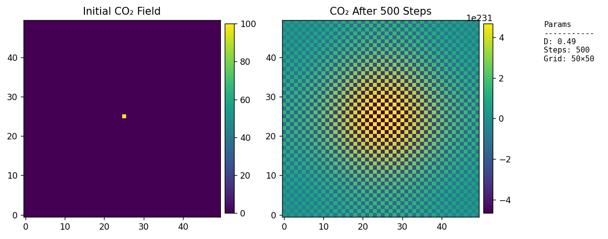
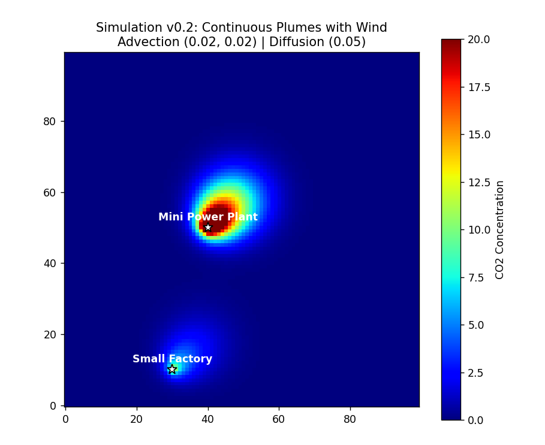
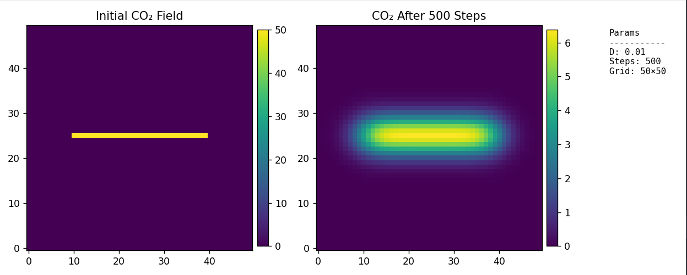
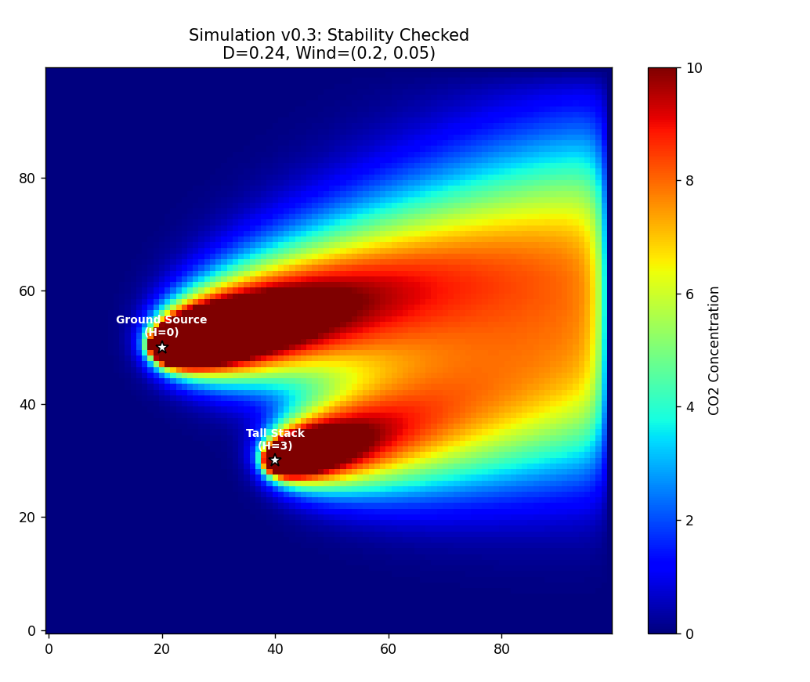

# TWIN: A Computational Framework for Urban CO₂ Advection-Diffusion Modeling

## Abstract
This repository presents **TWIN** (The Urban CO₂ Digital Twin), a modular computational framework designed to simulate the spatio-temporal dynamics of carbon dioxide (CO₂) within urban micro-environments. By employing finite-difference approximations of the Advection-Diffusion equation, the model evaluates the impact of anthropogenic emission sources (point, line, and area) and mitigation strategies (natural and artificial sinks) under varying atmospheric conditions. The project documents a progressive development lifecycle, transitioning from fundamental numerical solvers to a full-scale, interactive Digital Twin dashboard for urban planning and environmental analysis.

---

## 1. Introduction
The mitigation of greenhouse gas concentrations in urban areas requires high-fidelity spatial modeling of pollutant transport. Traditional Gaussian plume models often lack the flexibility for complex urban geometries or interactive feedback. TWIN addresses this by providing a grid-based simulation environment that integrates real-time atmospheric adjustments with a modular "City Builder" interface.

## 2. Methodology

### 2.1 Governing Equations
The core physics engine solves the two-dimensional Advection-Diffusion equation for the concentration field $C(x, y, t)$:

$$\frac{\partial C}{\partial t} + \mathbf{u} \cdot \nabla C = D \nabla^2 C + S$$

Where:
- $\mathbf{u} = (u_x, u_y)$ represents the wind velocity vector (Advection).
- $D$ is the diffusion coefficient.
- $S$ denotes the net source/sink term.

### 2.2 Numerical Discretization
- **Advection**: Implemented using a first-order **Upwind Scheme** to maintain numerical stability in the presence of dominant directional flow.
- **Diffusion**: Discretized via a five-point **Finite Difference Laplacian** stencil:
  $$\nabla^2 C \approx \frac{C_{i+1,j} + C_{i-1,j} + C_{i,j+1} + C_{i,j-1} - 4C_{i,j}}{(\Delta x)^2}$$
- **Boundary Conditions**: Implementation of **Open Boundaries** (Dirichlet-like at the edges) prevents artificial concentration buildup and simulates the continuous transport of pollutants out of the local domain.

### 2.3 Stability Analysis (CFL Condition)
To ensure convergence and prevent numerical oscillation, the simulation enforces the Courant–Friedrichs–Lewy (CFL) condition for explicit time-stepping:
$$D \le 0.25 \quad \text{and} \quad \max(|u_x|, |u_y|) \le 1.0$$

### 2.4 Source and Sink Modeling
The framework utilizes an Object-Oriented approach to define urban features:
- **Point Sources (Chimneys)**: Modeled with optional "Stack Height" logic using a 3x3 kernel spread to simulate plume dispersion at altitude.
- **Line Sources (Roads)**: Rasterized using linear interpolation for high-traffic corridor modeling.
- **Area Sources (Wildfires)**: Radial intensity distribution.
- **Sinks (Sequestration)**: Natural sequestration (forests) modeled as area-based negative sources; Artificial sinks (Direct Air Capture) modeled as point-based removals.

---

## 3. Computational Implementation & Version History

### 3.1 Phase I: Numerical Solvers (v0.1 - v0.4)
Initial development focused on the verification of the diffusion and advection kernels.
- **v0.1**: Verification of isotropic diffusion.
- **v0.2**: Integration of advection vectors.
- **v0.3/v0.4**: Implementation of stack height heuristics and stability checks.

### 3.2 Phase II: Dashboard Integration (v1.0)
Transitioned the physics engine to a **Streamlit**-based architecture, decoupling the UI from the computational back-end (`phy_eng.py`).

### 3.3 Phase III: Modular Digital Twin (v2.0 - v3.0)
Advanced feature set including:
- **Map Correlation**: Overlay of concentration heatmaps onto uploaded urban imagery.
- **Inventory Management**: Dynamic tracking of environmental assets within the simulation domain.

---

## 4. Results and Observations

*The following figures illustrate the model's performance across various developmental milestones.*

| Figure | Description |
| :--- | :--- |
|  | **Figure 1**: Baseline isotropic diffusion from a central point source (v0.1). |
|  | **Figure 2**: Impact of directional advection (Wind) on plume geometry (v0.2). |
|  | **Figure 3**: Simulation of a linear emission source representing an urban arterial road. |
|  | **Figure 4**: Comparative analysis of stack height dispersion (v0.3). |

---

## 5. Usage and Deployment

### 5.1 Installation
Install the required computational stack:
```bash
pip install numpy matplotlib streamlit Pillow scipy
```

### 5.2 Execution
To initialize the high-fidelity v3.0 Digital Twin:
```bash
streamlit run v3.0/app.py
```

## 6. Conclusion and Future Work
TWIN demonstrates a robust approach to localized CO₂ modeling. Future iterations will explore:
1. **Vertical Profiling**: Extension to 3D grid systems.
2. **Chemical Reactivity**: Incorporating secondary pollutant reactions.
3. **Real-time Data Assimilation**: Integration with IoT sensor networks for live city monitoring.

---
**Author Note**: This project was developed as part of the 100-Days-of-Programming challenge, focusing on the intersection of environmental science and software engineering.
